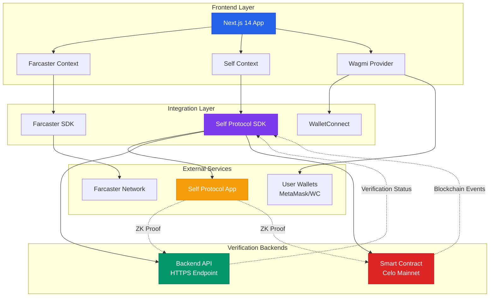
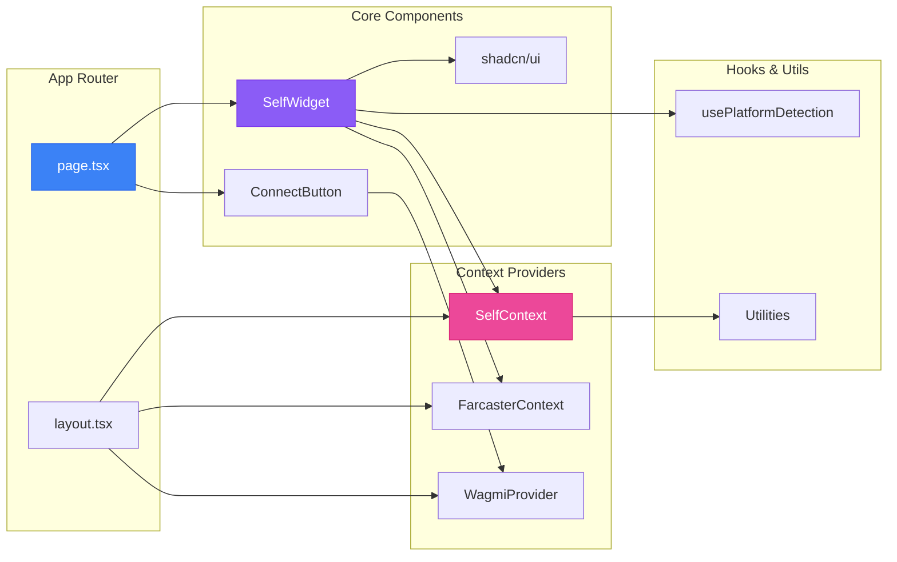
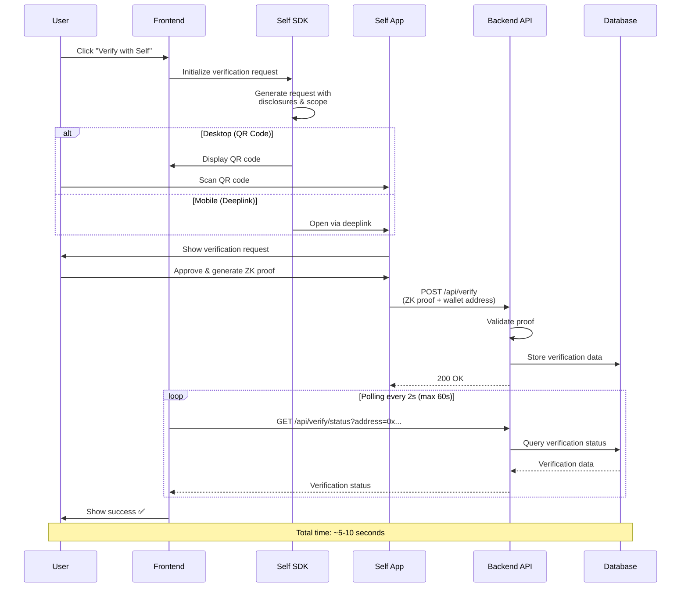
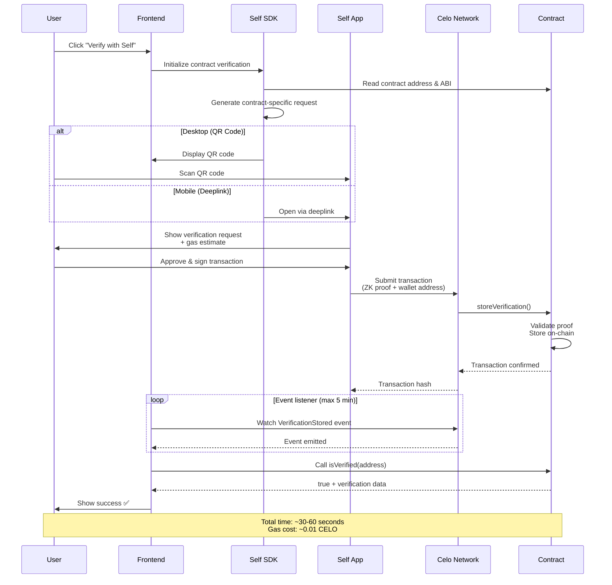
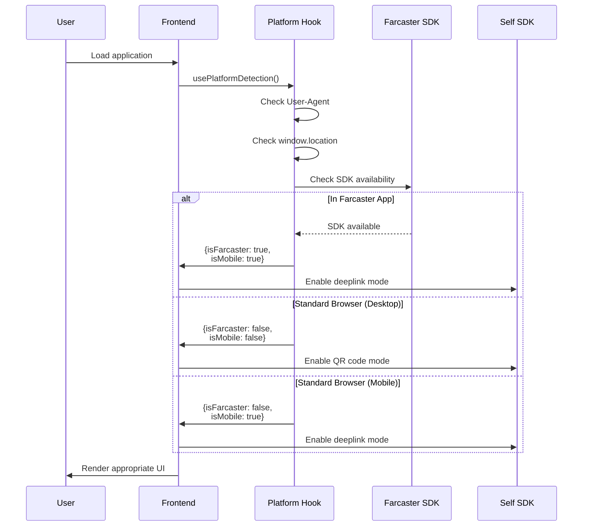

# Connect Hub
## Self Protocol Farcaster Mini App with WalletConnect

A production-ready Farcaster Mini App template that developers can use to build web applications with privacy-preserving identity verification. Works seamlessly inside Farcaster and as a standalone web app, featuring dual verification modes (Backend API + Smart Contract) with QR code and deeplink support.

## 🎯 What is This?

This is a **developer template** for building Farcaster Mini Apps with Self Protocol identity verification. Use this as a starting point to create your own applications that need:

- ✅ **Farcaster Integration** - Auto-connects in Farcaster environment, works anywhere
- ✅ **Identity Verification** - Privacy-preserving verification via Self Protocol
- ✅ **Flexible Verification** - Choose backend API or on-chain smart contract storage
- ✅ **Multi-Platform Support** - QR codes for desktop, deeplinks for mobile
- ✅ **Wallet Support** - WalletConnect, MetaMask, and Farcaster wallet integration

## 🚀 Live Demo

- **App URL**: [https://farcaster.xyz/miniapps/aybykrGNomla/connect-hub](https://farcaster.xyz/miniapps/aybykrGNomla/connect-hub)
- **Farcaster Frame**: Available in Farcaster feeds
- **Contract**: [0x5c36cfc25dce95976ce947daaea260b131776d2c](https://celoscan.io/address/0x5c36cfc25dce95976ce947daaea260b131776d2c) (Celo Mainnet)

## ✨ Key Features

### Dual Verification Modes

**1. Backend API Verification** 🖥️
- Fast verification via HTTPS endpoint
- Data stored in your backend database
- Full control over data storage and access
- Ideal for applications requiring flexible data management

**2. Smart Contract Verification** ⛓️
- Decentralized verification on Celo Mainnet
- Immutable on-chain storage
- Transparent and auditable
- No backend database required

### Verification Methods

Both modes support:
- **QR Code** 📱 - Scan with Self Protocol mobile app (perfect for desktop users)
- **Deeplink** 🔗 - One-tap verification (optimized for mobile users)

### Platform Detection

Automatically adapts to:
- Standard web browsers
- Farcaster browser (Warpcast)
- Farcaster mobile app
- Deep linking across all platforms

## 🎨 Use Cases

This template is perfect for building:

- 🎫 **Event Registration** - Verify age and identity for event access
- 🎮 **Gaming Platforms** - Age verification and anti-sybil protection
- 💰 **DeFi Applications** - Compliant identity verification for financial services
- 🌐 **Social Platforms** - Verified user profiles and community access
- 🎭 **NFT Marketplaces** - Creator verification and collector authentication
- 📱 **Mini Apps** - Any Farcaster Mini App requiring identity verification

## 📦 What's Included

```
self-farcaster-walletconnect-kit/
├── MiniApp/                          # Next.js 14 frontend application
│   ├── app/                          # App router with layout and pages
│   ├── components/
│   │   ├── SelfWidget.tsx           # Main verification component
│   │   ├── ConnectButton.tsx        # Multi-wallet connection
│   │   └── ui/                      # shadcn/ui components
│   ├── contexts/
│   │   ├── SelfContext.tsx          # Self Protocol state management
│   │   ├── FarcasterContext.tsx     # Farcaster SDK integration
│   │   └── WagmiProvider.tsx        # Wallet connection provider
│   ├── public/
│   │   ├── .well-known/
│   │   │   └── farcaster.json       # Farcaster Mini App manifest
│   │   └── images/                  # App icons and banners
│   └── hooks/
│       └── usePlatformDetection.ts  # Platform detection utilities
│
├── Contract/                         # Foundry smart contracts
│   ├── src/
│   │   └── VerificationRegistry.sol # On-chain verification contract
│   ├── script/
│   │   └── deploy-verification.sh   # Deployment script
│   └── test/                        # Contract tests
│
└── SelfExample-backend/             # Reference backend implementation
```

## 🚀 Quick Start

### Prerequisites

- Node.js 18+ and npm/yarn/pnpm
- [Self Protocol mobile app](https://www.self.xyz/) installed on your phone
- [WalletConnect Project ID](https://cloud.walletconnect.com/) (free)
- (Optional) Foundry for smart contract deployment

### 1. Clone and Install

```bash
# Clone the repository
git clone https://github.com/yourusername/self-farcaster-walletconnect-kit.git
cd self-farcaster-walletconnect-kit/MiniApp

# Install dependencies
npm install
```

### 2. Configure Environment

Copy the example environment file:

```bash
cp .env.example .env
```

Edit `.env` with your configuration:

```bash
# Required: WalletConnect Project ID
NEXT_PUBLIC_WALLETCONNECT_PROJECT_ID=your_walletconnect_project_id

# Required: Self Protocol Configuration
NEXT_PUBLIC_SELF_SCOPE=your-app-scope                    # Unique scope for your app
NEXT_PUBLIC_SELF_APP_NAME=Your App Name                  # Display name in Self app

# Optional: Backend API Verification
NEXT_PUBLIC_SELF_BACKEND_ENDPOINT=https://yourapi.com/api/verify

# Optional: Smart Contract Verification (use deployed contract or deploy your own)
NEXT_PUBLIC_VERIFICATION_CONTRACT_ADDRESS=0x5c36cfc25dce95976ce947daaea260b131776d2c
NEXT_PUBLIC_SELF_ENDPOINT_TYPE=celo                      # celo, base, staging_celo, staging_base
NEXT_PUBLIC_CELO_MAINNET_RPC=https://forno.celo.org      # Celo RPC endpoint

# Site Configuration
NEXT_PUBLIC_SITE_URL=http://localhost:3000
NEXT_PUBLIC_SITE_NAME=Your App Name

# Farcaster Mini App Assets (update with your domain after deployment)
NEXT_PUBLIC_APP_IMAGE_URL=https://yourdomain.com/banner.png
NEXT_PUBLIC_APP_SPLASH_URL=https://yourdomain.com/splash.png
NEXT_PUBLIC_APP_SPLASH_BG_COLOR=#1a1a2e
```

### 3. Run Development Server

```bash
npm run dev
```

Visit [http://localhost:3000](http://localhost:3000)

### 4. Test Verification

**For Desktop (QR Code):**
1. Connect your wallet
2. Choose Backend or Smart Contract tab
3. Click "Show QR" button
4. Scan with Self Protocol mobile app
5. Complete verification in the app
6. Wait for confirmation (backend: instant, contract: ~30 seconds)

**For Mobile (Deeplink):**
1. Open app on mobile browser
2. Connect your wallet
3. Choose verification mode
4. Tap "Verify with Self" button
5. App redirects to Self Protocol app
6. Complete verification
7. Return to app for confirmation

## 🔐 Verification Modes Explained

### Backend API Verification

**How it works:**
1. User initiates verification
2. Frontend generates verification request
3. User verifies in Self Protocol app
4. Backend receives and validates proof
5. Verification data stored in your database
6. Frontend polls backend for status

**Best for:**
- Applications needing flexible data storage
- Custom verification logic
- Integration with existing user databases
- Real-time updates and notifications

**Setup:**
- Implement backend endpoint (see `SelfExample-backend/`)
- Configure `NEXT_PUBLIC_SELF_BACKEND_ENDPOINT`
- Handle proof validation and storage

### Smart Contract Verification

**How it works:**
1. User initiates verification
2. Frontend generates contract-specific request
3. User verifies in Self Protocol app
4. Proof submitted to Celo blockchain
5. Contract validates and stores verification
6. Frontend monitors blockchain events
7. Verification data read from contract

**Best for:**
- Decentralized applications
- Transparent, auditable verification
- No backend infrastructure required
- Permanent, immutable records

**Setup:**
- Use deployed contract or deploy your own (see `Contract/README.md`)
- Configure contract address and chain
- User needs CELO tokens for gas (~0.01 CELO)

## 🎨 Customization Guide

### 1. Update Branding

Replace images in `MiniApp/public/`:
- `icon3.png` - App icon (200x200px recommended)
- `banner3.png` - Social sharing banner (1200x630px)
- `splash2.png` - Launch splash screen (1200x1200px)

### 2. Customize Farcaster Manifest

Edit `MiniApp/public/.well-known/farcaster.json`:

```json
{
  "frame": {
    "name": "Your App Name",
    "iconUrl": "https://yourdomain.com/icon3.png",
    "homeUrl": "https://yourdomain.com",
    "imageUrl": "https://yourdomain.com/banner3.png",
    "buttonTitle": "Launch Your App",
    "splashImageUrl": "https://yourdomain.com/splash2.png",
    "splashBackgroundColor": "#your-color"
  }
}
```

### 3. Customize Verification Requirements

Edit `SelfWidget.tsx` disclosures:

```typescript
disclosures: {
  minimumAge: 18,              // Required minimum age
  excludedCountries: [],       // Country restrictions
  ofac: false,                 // OFAC sanctions check
  date_of_birth: true,         // Request date of birth
  name: false,                 // Request full name
  nationality: false,          // Request nationality
}
```

### 4. Add Custom Verification Logic

Extend `SelfContext.tsx` to add custom handlers:

```typescript
const handleVerificationSuccess = (data: any) => {
  // Your custom logic here
  console.log('Verification completed:', data)

  // Store in database, trigger actions, etc.
}
```

## 📱 Deploy Your Farcaster Mini App

### 1. Build for Production

```bash
cd MiniApp
npm run build
```

### 2. Deploy to Vercel (Recommended)

```bash
# Install Vercel CLI
npm i -g vercel

# Deploy
vercel --prod
```

Or use Vercel's GitHub integration for automatic deployments.

### 3. Update Environment Variables

In your deployment platform, set all environment variables from `.env`.

### 4. Configure Custom Domain

Point your domain to the deployment and update:
- `NEXT_PUBLIC_SITE_URL`
- Farcaster manifest URLs
- Image URLs in `.env`

### 5. Submit to Farcaster

Once deployed:
1. Ensure your `.well-known/farcaster.json` is accessible
2. Test your Mini App URL
3. Share in Farcaster or submit for official listing

## 🛠 Smart Contract Deployment

Want to deploy your own verification contract?

```bash
cd Contract

# Install Foundry dependencies
forge install

# Set up environment
cp .env.example .env
# Add your PRIVATE_KEY and RPC URLs

# Deploy to Celo Mainnet
./script/deploy-verification.sh

# Update MiniApp/.env with your contract address
NEXT_PUBLIC_VERIFICATION_CONTRACT_ADDRESS=0xYourContractAddress
```

See [Contract/README.md](Contract/README.md) for detailed deployment instructions.

## 🧪 Testing

```bash
# Test frontend
cd MiniApp
npm test

# Test smart contracts
cd Contract
forge test

# Run with coverage
forge coverage
```

## 📖 Architecture Deep Dive

### System Architecture



### Component Architecture



### Verification Flow Sequences

#### Backend API Verification Flow



#### Smart Contract Verification Flow



#### Platform Detection Flow



### Frontend Architecture

- **Next.js 14** - App router with React Server Components
- **TypeScript** - Full type safety
- **Tailwind CSS** - Utility-first styling
- **shadcn/ui** - High-quality React components
- **Wagmi v2** - Ethereum wallet connections
- **Viem** - TypeScript Ethereum library

### Self Protocol Integration

The app uses Self Protocol's privacy-preserving zero-knowledge proof system:

1. **Request Generation** - App creates verification request with disclosure requirements
2. **User Verification** - User proves identity in Self mobile app (data never leaves device)
3. **Proof Submission** - Zero-knowledge proof submitted to backend or smart contract
4. **Verification** - Proof validated without revealing underlying identity data
5. **Storage** - Verification result stored (backend DB or blockchain)

### Data Flow Summary

**Backend Mode:**
```
User Action → Generate Request → Open Self App → Backend Polling → Success
```

**Contract Mode:**
```
User Action → Generate Request → Open Self App → Blockchain Event Listener → Success
```

## 🔧 Troubleshooting

### Common Issues

**Issue: Verification timeout**
- **Backend**: Check backend endpoint is accessible
- **Contract**: Ensure user has CELO for gas fees
- **Both**: Verify Self app is installed and up to date

**Issue: QR code doesn't show**
- Check Self Protocol SDK initialization in browser console
- Verify environment variables are set correctly
- Ensure `NEXT_PUBLIC_SELF_SCOPE` is unique

**Issue: Deeplink doesn't open Self app**
- Test on actual mobile device (doesn't work in desktop browsers)
- Ensure Self app is installed
- Check deeplink callback URL is correct

**Issue: Contract events not detected**
- Verify RPC endpoint is working (`NEXT_PUBLIC_CELO_MAINNET_RPC`)
- Check transaction was successful on block explorer
- Wait up to 5 minutes for event polling

### Debug Mode

Enable verbose logging:

```typescript
// In components, add:
console.log('🔍 Debug:', { variable1, variable2 })
```

Check browser console for detailed flow information.

## 📚 Additional Resources

### Documentation

- [Self Protocol Docs](https://docs.self.xyz/) - Identity verification SDK
- [Farcaster Mini Apps Guide](https://docs.farcaster.xyz/developers/guides/apps/mini-apps) - Building Mini Apps
- [WalletConnect v2 Docs](https://docs.walletconnect.com/) - Wallet integration
- [Wagmi Documentation](https://wagmi.sh/) - React hooks for Ethereum
- [Celo Developer Docs](https://docs.celo.org/) - Celo blockchain

### Example Apps

- [ZodiacCards](https://github.com/yourusername/ZodiacCards) - Fortune telling Mini App
- [Self Protocol Examples](https://github.com/joinself) - Official examples

### Support

- **Issues**: [GitHub Issues](https://github.com/yourusername/self-farcaster-walletconnect-kit/issues)
- **Discussions**: [GitHub Discussions](https://github.com/yourusername/self-farcaster-walletconnect-kit/discussions)
- **Self Protocol**: [Discord](https://discord.gg/self-protocol)
- **Farcaster**: [Developer Chat](https://warpcast.com/~/channel/fc-devs)

## 🤝 Contributing

We welcome contributions! Here's how:

1. Fork the repository
2. Create a feature branch (`git checkout -b feature/amazing-feature`)
3. Commit your changes (`git commit -m 'Add amazing feature'`)
4. Push to the branch (`git push origin feature/amazing-feature`)
5. Open a Pull Request

Please ensure:
- Code follows existing style
- Tests pass (`npm test`)
- Documentation is updated
- Commit messages are clear

## 📄 License

MIT License - see [LICENSE](LICENSE) file for details.

## 🙏 Acknowledgments

Built with:
- [Self Protocol](https://self.xyz/) - Privacy-preserving identity verification
- [Farcaster](https://www.farcaster.xyz/) - Decentralized social protocol
- [Celo](https://celo.org/) - Mobile-first blockchain
- [Foundry](https://getfoundry.sh/) - Ethereum development toolkit
- [Next.js](https://nextjs.org/) - React framework
- [shadcn/ui](https://ui.shadcn.com/) - UI component library

---

**Built by CodaLabs** | **Powered by Self Protocol** | **Deploy on Farcaster**

[Live Demo](https://connecthub.codalabs.xyz) • [Documentation](https://docs.self.xyz/) • [Report Bug](https://github.com/yourusername/self-farcaster-walletconnect-kit/issues)
